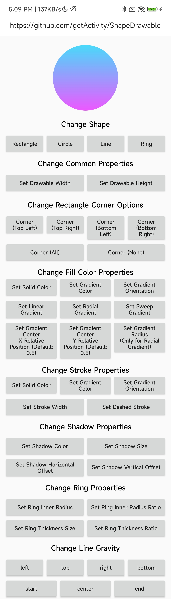

# ShapeDrawable Framework

* Project address: [Github](https://github.com/getActivity/ShapeDrawable)

* [Click here to download demo apk directly](https://github.com/getActivity/ShapeDrawable/releases/download/3.3/ShapeDrawable.apk)



#### Integration Steps

* If your project's Gradle configuration is `below 7.0`, you need to add the following in the `build.gradle` file

```groovy
allprojects {
    repositories {
        // JitPack remote repository: https://jitpack.io
        maven { url 'https://jitpack.io' }
    }
}
```

* If your Gradle configuration is `7.0 or above`, you need to add the following in the `settings.gradle` file

```groovy
dependencyResolutionManagement {
    repositories {
        // JitPack remote repository: https://jitpack.io
        maven { url 'https://jitpack.io' }
    }
}
```

* After configuring the remote repository, add the remote dependency in the `build.gradle` file under the app module of your project

```groovy
android {
    // Support JDK 1.8
    compileOptions {
        targetCompatibility JavaVersion.VERSION_1_8
        sourceCompatibility JavaVersion.VERSION_1_8
    }
}

dependencies {
    // ShapeDrawable: https://github.com/getActivity/ShapeDrawable
    implementation 'com.github.getActivity:ShapeDrawable:3.3'
}
```

#### Support library compatible

* Option 1: Use remote dependencies of the old version framework

```groovy
dependencies {
    // ShapeDrawable: https://github.com/getActivity/ShapeDrawable
    implementation 'com.github.getActivity:ShapeDrawable:3.3'
}
```

* Option 2: If your project is still in the Support phase and it's not convenient to migrate to **AndroidX** yet, but you want to use the latest version of the framework, you can use the [JetifierStandalone](https://developer.android.com/tools/jetifier#install) tool provided by **Google** to convert the **aar** packages from the released Release versions into **Support-compatible aar** packages using reverse mode.

* You can choose either of the above two options, but it's still not recommended. These are only stopgap measures, not long-term solutions. Subsequent versions of the framework will no longer support **Support** projects. The best approach is to migrate your project to **AndroidX**.

#### Framework Documentation

* General Properties

```java
// Set Shape type
setType(@ShapeTypeLimit int shape);

// Set Shape width
setWidth(int width);

// Set Shape height
setHeight(int height);

// Set rectangle corner radius
setRadius(float radius);
setRadius(float topLeftRadius, float topRightRadius, float bottomLeftRadius, float bottomRightRadius);
```

* Fill Color Related

```java
// Set fill color
setSolidColor(@ColorInt int startColor, @ColorInt int endColor);
setSolidColor(@ColorInt int startColor, @ColorInt int centerColor, @ColorInt int endColor);
setSolidColor(@ColorInt int... colors);

// Set fill color gradient type
setSolidGradientType(@ShapeGradientTypeLimit int type);

// Set fill color gradient orientation
setSolidGradientOrientation(ShapeGradientOrientation orientation);

// Set the relative position of the fill color gradient center X coordinate (default value is 0.5)
setSolidGradientCenterX(float centerX);
// Set the relative position of the fill color gradient center Y coordinate (default value is 0.5)
setSolidGradientCenterY(float centerY);

// Set the fill color gradient radius size
setSolidGradientRadius(float radius);
```

* Border Color Related

```java
// Set border color
setStrokeColor(@ColorInt int startColor, @ColorInt int endColor);
setStrokeColor(@ColorInt int startColor, @ColorInt int centerColor, @ColorInt int endColor);
setStrokeColor(@ColorInt int... colors);

// Set border color gradient orientation
setStrokeGradientOrientation(ShapeGradientOrientation orientation);

// Set border size
setStrokeSize(int size);

// Set the width of each dash section of the border
setStrokeDashSize(float dashSize);
// Set the gap of each dash section of the border
setStrokeDashGap(float dashGap);
```

* Shadow Related

```java
// Set shadow color
setShadowColor(@ColorInt int color);

// Set shadow size
setShadowSize(int size);

// Set shadow horizontal offset
setShadowOffsetX(int offsetX);

// Set shadow vertical offset
setShadowOffsetY(int offsetY);
```

* Ring Related

```java
// Set the inner ring radius size
setRingInnerRadiusSize(int size);
// Set the inner ring radius ratio
setRingInnerRadiusRatio(float ratio);

// Set the outer ring thickness size
setRingThicknessSize(int size);
// Set the outer ring thickness ratio
setRingThicknessRatio(float ratio);
```

* Line Related

```java
// Set line gravity
setLineGravity(int lineGravity);
```

* Others

```java
// Apply the current Drawable object to the View background. You need to call this API to set it to the View background, otherwise the dashed line or shadow may not take effect
intoBackground(View view);
```

#### Framework Highlights

* More powerful than the system-provided GradientDrawable, ShapeDrawable supports setting shadows (color, size, offset)

* More powerful than the system-provided GradientDrawable, ShapeDrawable supports setting gradient colors for the border separately (gradient color values, gradient color orientation)

* More powerful than the system-provided GradientDrawable, ShapeDrawable supports setting the direction for lines separately (top, bottom, left, right, start, end directions are all supported)

#### Other Open Source Projects by the Author

* Android middle office: [AndroidProject](https://github.com/getActivity/AndroidProject)

* Android middle office kt version: [AndroidProject-Kotlin](https://github.com/getActivity/AndroidProject-Kotlin)

* Permissions framework: [XXPermissions](https://github.com/getActivity/XXPermissions)  

* Toast framework: [Toaster](https://github.com/getActivity/Toaster)

* Network framework: [EasyHttp](https://github.com/getActivity/EasyHttp)

* Title bar framework: [TitleBar](https://github.com/getActivity/TitleBar)

* Floating window framework: [EasyWindow](https://github.com/getActivity/EasyWindow)

* Device compatibility framework：[DeviceCompat](https://github.com/getActivity/DeviceCompat)  

* Shape view framework: [ShapeView](https://github.com/getActivity/ShapeView)

* Language switching framework: [Multi Languages](https://github.com/getActivity/MultiLanguages)

* Gson parsing fault tolerance: [GsonFactory](https://github.com/getActivity/GsonFactory)

* Logcat viewing framework: [Logcat](https://github.com/getActivity/Logcat)

* Nested scrolling layout framework：[NestedScrollLayout](https://github.com/getActivity/NestedScrollLayout)  

* Android cmd tools：[AndroidCmdTools](https://github.com/getActivity/AndroidCmdTools)  

* Android version guide: [AndroidVersionAdapter](https://github.com/getActivity/AndroidVersionAdapter)

* Android code standard: [AndroidCodeStandard](https://github.com/getActivity/AndroidCodeStandard)

* Android resource summary：[AndroidIndex](https://github.com/getActivity/AndroidIndex)  

* Android open source leaderboard: [AndroidGithubBoss](https://github.com/getActivity/AndroidGithubBoss)

* Studio boutique plugins: [StudioPlugins](https://github.com/getActivity/StudioPlugins)

* Emoji collection: [EmojiPackage](https://github.com/getActivity/EmojiPackage)

* China provinces json: [ProvinceJson](https://github.com/getActivity/ProvinceJson)

* Markdown documentation：[MarkdownDoc](https://github.com/getActivity/MarkdownDoc)  

## License

```text
Copyright 2023 Huang JinQun

Licensed under the Apache License, Version 2.0 (the "License");
you may not use this file except in compliance with the License.
You may obtain a copy of the License at

   http://www.apache.org/licenses/LICENSE-2.0

Unless required by applicable law or agreed to in writing, software
distributed under the License is distributed on an "AS IS" BASIS,
WITHOUT WARRANTIES OR CONDITIONS OF ANY KIND, either express or implied.
See the License for the specific language governing permissions and
limitations under the License.
```