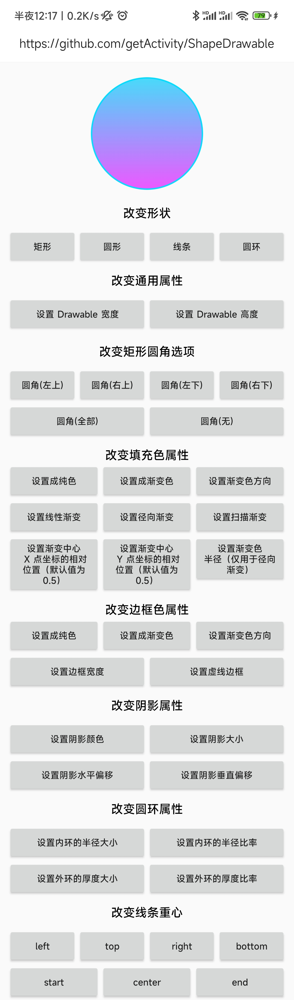

# ShapeDrawable 框架

* 项目地址：[Github](https://github.com/getActivity/ShapeDrawable)

* 可以扫码下载 Demo 进行演示或者测试，如果扫码下载不了的，[点击此处可直接下载](https://github.com/getActivity/ShapeDrawable/releases/download/3.0/ShapeDrawable.apk)




#### 集成步骤

* 如果你的项目 Gradle 配置是在 `7.0 以下`，需要在 `build.gradle` 文件中加入

```groovy
allprojects {
    repositories {
        // JitPack 远程仓库：https://jitpack.io
        maven { url 'https://jitpack.io' }
    }
}
```

* 如果你的 Gradle 配置是 `7.0 及以上`，则需要在 `settings.gradle` 文件中加入

```groovy
dependencyResolutionManagement {
    repositories {
        // JitPack 远程仓库：https://jitpack.io
        maven { url 'https://jitpack.io' }
    }
}
```

* 配置完远程仓库后，在项目 app 模块下的 `build.gradle` 文件中加入远程依赖

```groovy
android {
    // 支持 JDK 1.8
    compileOptions {
        targetCompatibility JavaVersion.VERSION_1_8
        sourceCompatibility JavaVersion.VERSION_1_8
    }
}

dependencies {
    // ShapeDrawable：https://github.com/getActivity/ShapeDrawable
    implementation 'com.github.getActivity:ShapeDrawable:3.0'
}
```

#### 框架文档

* 通用属性

```java
// 设置 Shape 形状
setType(@ShapeTypeLimit int shape)

// 设置 Shape 宽度
setWidth(int width)

// 设置 Shape 高度
setHeight(int height)

// 设置矩形的圆角大小
setRadius(float radius)
setRadius(float topLeftRadius, float topRightRadius, float bottomLeftRadius, float bottomRightRadius)
```

* 填充色相关

```java
// 设置填充色
setSolidColor(@ColorInt int startColor, @ColorInt int endColor)
setSolidColor(@ColorInt int startColor, @ColorInt int centerColor, @ColorInt int endColor)
setSolidColor(@ColorInt int... colors)

// 设置填充色渐变类型
setSolidGradientType(@ShapeGradientTypeLimit int type)

// 设置填充色渐变方向
setSolidGradientOrientation(@ShapeGradientOrientationLimit int orientation)

// 设置填充色渐变中心 X 点坐标的相对位置（默认值为 0.5）
setSolidGradientCenterX(float centerX)
// 设置填充色渐变中心 Y 点坐标的相对位置（默认值为 0.5）
setSolidGradientCenterY(float centerY)

// 设置填充色渐变半径大小
setSolidGradientRadius(float radius)
```

* 边框色相关

```java
// 设置边框色
setStrokeColor(@ColorInt int startColor, @ColorInt int endColor)
setStrokeColor(@ColorInt int startColor, @ColorInt int centerColor, @ColorInt int endColor)
setStrokeColor(@ColorInt int... colors)

// 设置边框色渐变方向
setStrokeGradientOrientation(@ShapeGradientOrientationLimit int orientation)

// 设置边框大小
setStrokeSize(int size)

// 设置边框每一节虚线宽度
setStrokeDashSize(float dashSize)
// 设置边框虚线每一节间隔
setStrokeDashGap(float dashGap)
```

* 阴影相关

```java
// 设置阴影颜色
setShadowColor(@ColorInt int color)

// 设置阴影大小
setShadowSize(int size)

// 设置阴影水平偏移
setShadowOffsetX(int offsetX)

// 设置阴影垂直偏移
setShadowOffsetY(int offsetY)
```

* 圆环相关

```java
// 设置内环的半径大小
setRingInnerRadiusSize(int size)
// 设置内环的半径比率
setRingInnerRadiusRatio(float ratio)

// 设置外环的厚度大小
setRingThicknessSize(int size)
// 设置外环的厚度比率
setRingThicknessRatio(float ratio)
```

* 线条相关

```java
// 设置线条重心
setLineGravity(int lineGravity)
```

* 其他的

```java
// 将当前 Drawable 对象应用到 View 背景，需要调用此 API 设置到 View 背景，否则可能会导致虚线或者阴影无法生效
intoBackground(View view)
```

#### 作者的其他开源项目

* 安卓技术中台：[AndroidProject](https://github.com/getActivity/AndroidProject)  

* 安卓技术中台 Kt 版：[AndroidProject-Kotlin](https://github.com/getActivity/AndroidProject-Kotlin)  

* 权限框架：[XXPermissions](https://github.com/getActivity/XXPermissions)  

* 吐司框架：[Toaster](https://github.com/getActivity/Toaster)  

* 网络框架：[EasyHttp](https://github.com/getActivity/EasyHttp)  

* 标题栏框架：[TitleBar](https://github.com/getActivity/TitleBar)  

* 悬浮窗框架：[EasyWindow](https://github.com/getActivity/EasyWindow)  

* ShapeView 框架：[ShapeView](https://github.com/getActivity/ShapeView)  

* 语种切换框架：[MultiLanguages](https://github.com/getActivity/MultiLanguages)  

* Gson 解析容错：[GsonFactory](https://github.com/getActivity/GsonFactory)  

* 日志查看框架：[Logcat](https://github.com/getActivity/Logcat)  

* 嵌套滚动布局框架：[NestedScrollLayout](https://github.com/getActivity/NestedScrollLayout)  

* Android 版本适配：[AndroidVersionAdapter](https://github.com/getActivity/AndroidVersionAdapter)  

* Android 代码规范：[AndroidCodeStandard](https://github.com/getActivity/AndroidCodeStandard)  

* Android 资源大汇总：[AndroidIndex](https://github.com/getActivity/AndroidIndex)  

* Android 开源排行榜：[AndroidGithubBoss](https://github.com/getActivity/AndroidGithubBoss)  

* Studio 精品插件：[StudioPlugins](https://github.com/getActivity/StudioPlugins)  

* 表情包大集合：[EmojiPackage](https://github.com/getActivity/EmojiPackage)  

* 省市区 Json 数据：[ProvinceJson](https://github.com/getActivity/ProvinceJson)  

#### 微信公众号：Android轮子哥


#### Android 技术 Q 群：10047167

#### 如果您觉得我的开源库帮你节省了大量的开发时间，请扫描下方的二维码随意打赏，要是能打赏个 10.24 :monkey_face:就太:thumbsup:了。您的支持将鼓励我继续创作:octocat:

 

#### [点击查看捐赠列表](https://github.com/getActivity/Donate)

## License

```text
Copyright 2023 Huang JinQun

Licensed under the Apache License, Version 2.0 (the "License");
you may not use this file except in compliance with the License.
You may obtain a copy of the License at

   http://www.apache.org/licenses/LICENSE-2.0

Unless required by applicable law or agreed to in writing, software
distributed under the License is distributed on an "AS IS" BASIS,
WITHOUT WARRANTIES OR CONDITIONS OF ANY KIND, either express or implied.
See the License for the specific language governing permissions and
limitations under the License.
```